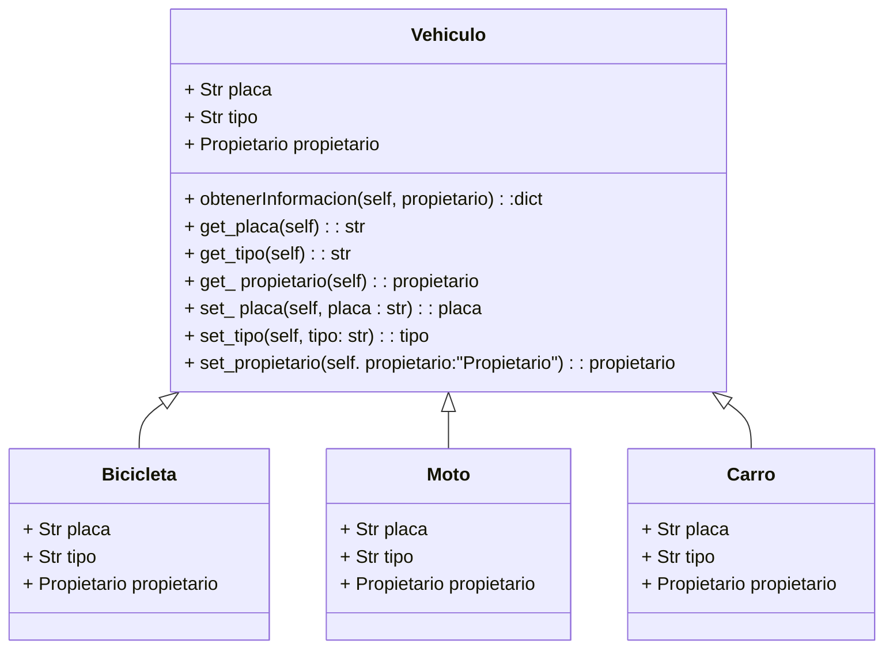
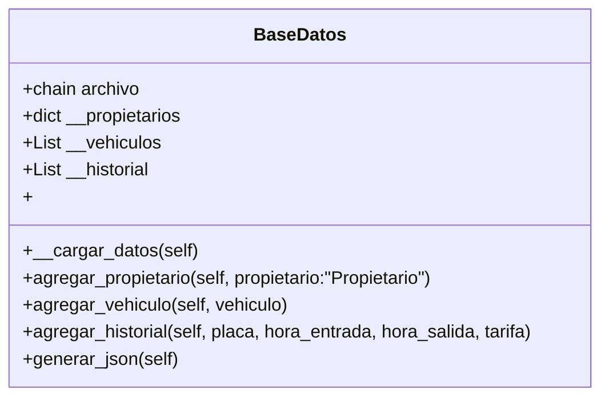
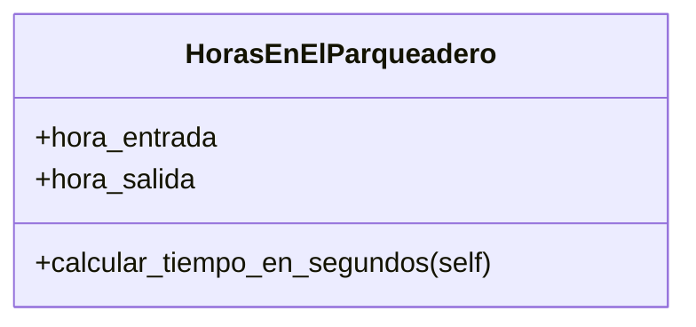
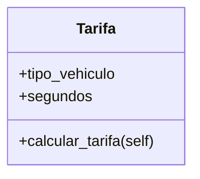
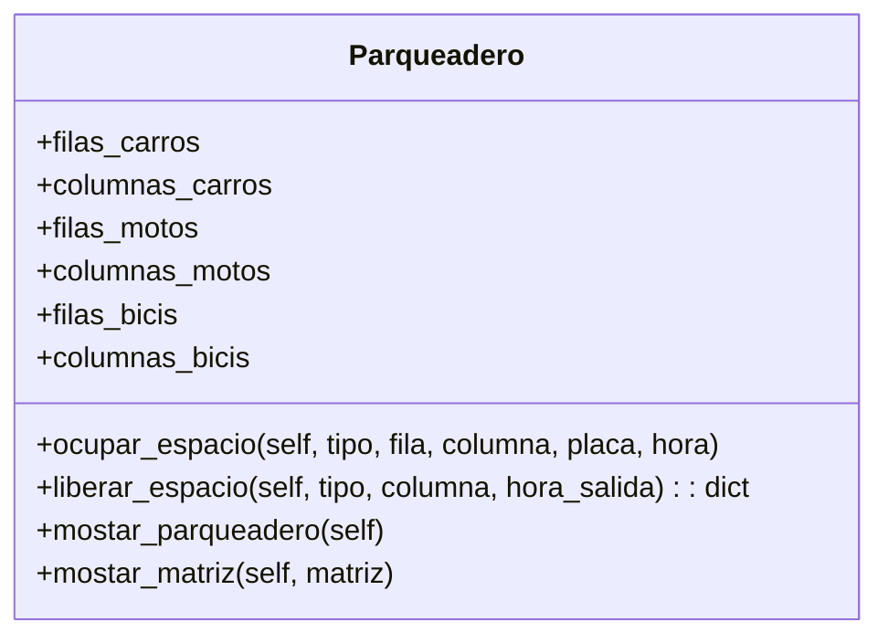
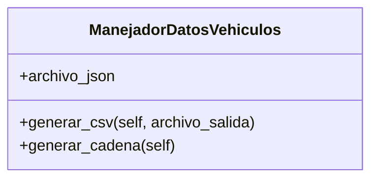

# Project POO

## Nombre del Grupo: ***Puppet Masters***

## Integrantes
- Juan Manuel Berdugo Torres
- Valentina Carreño Granados
- Fabian Camilo Arciniegas Morales

## Tabla de Contenido
- [Introducción](#introducción)
- [Problema](#problema)
- [Solución](#solución)
- [Diagramas de Clase](#diagramas-de-clase)
  - [Propietario](#propietario)
  - [Vehiculo](#vehiculo)
  - [BaseDeDatos](#basededatos)
  - [HorasEnElParqueadero](#horasenelparqueadero)
  - [Tarifa](#tarifa)
  - [Parqueadero](#parqueadero)
  - [ManejadorDatosVehiculo](#manejadordatosvehiculo)
- [Resultados Parciales](#resultados-parciales)
- 
## Introducción
El tráfico en las grandes ciudades es un problema creciente que afecta la movilidad y calidad de vida de millones de personas. La saturación vehicular no solo genera largas demoras, sino que también incrementa la contaminación ambiental y el estrés en los conductores. Un factor clave que contribuye a este problema es la dificultad para encontrar estacionamiento, lo que provoca que muchos conductores den vueltas innecesarias dentro de los parqueaderos o incluso en las calles, aumentando el tráfico y el consumo de combustible. Estudios han demostrado que la exposición prolongada a situaciones de congestión vehicular eleva los niveles de cortisol, la hormona del estrés, lo que puede derivar en problemas de salud como hipertensión y fatiga crónica. Para mitigar estos efectos, es esencial contar con soluciones que optimicen la búsqueda de estacionamiento y reduzcan el tiempo que los conductores permanecen innecesariamente en circulación.

## Problema
Uno de los mayores problemas en los parqueaderos es la falta de información en tiempo real sobre la disponibilidad de espacios, lo que obliga a los conductores a recorrer el estacionamiento sin una guía clara. En promedio, una persona puede tardar hasta 8 minutos buscando un lugar para estacionar, lo que no solo genera frustración y estrés, sino que también contribuye al tráfico dentro del parqueadero y al desperdicio de tiempo y combustible. Esta situación impacta negativamente la experiencia del usuario, especialmente en lugares concurridos como centros comerciales, donde el flujo constante de vehículos dificulta aún más el proceso. Para abordar este problema, es fundamental contar con un sistema eficiente que optimice la asignación de espacios y brinde información actualizada a los conductores.

## Solución
Desarrollar un sistema inteligente de gestión de parqueaderos que permita monitorear en tiempo real la disponibilidad de espacios, informando a los usuarios sobre los lugares libres y registrando automáticamente la entrada y salida de los vehículos. La información será procesada y mostrada en una interfaz accesible para los usuarios, facilitando la búsqueda de estacionamiento. Además, el sistema llevará un registro detallado de los vehículos que ingresan y salen, optimizando la administración del parqueadero.


## Diagramas de Clase
``` mermaid
classDiagram

 class ConnectorDB {
        - str host
        - str user
        - str password
        - str database
        - connection
        - cursor
        + ConnectorDB(host, user, password, database)
        + connect()
    }
    
    class PropietarioDB {
        - int _id_propietario
        - str _nombre
        - str _telefono
        - str _correo
        + PropietarioDB(identificacion, nombre, telefono, correo, host, user, password, database)
        + id_propietario: int
        + nombre: str
        + telefono: str
        + correo: str
        + agregar_propietario()
        + obtener_propietario_por_id()
        + actualizar_propietario()
        + eliminar_propietario(id_propietario)
        + obtener_propietarios()
        + cerrar_conexion()
    }
    
    class ConnectorDB {
        + connect()
    }


    class VehiculoDB {
        - str _placa
        - str _tipo
        - int _propietario
        + VehiculoDB(placa, tipo, propietario, host, user, password, database)
        + placa: str
        + tipo: str
        + propietario: int
        + agregar_vehiculo()
        + obtener_vehiculo_por_placa()
        + actualizar_vehiculo()
        + eliminar_vehiculo()
        + obtener_vehiculos()
        + cerrar_conexion()
    }
    
    class ConnectorDB {
        + connect()
    }

    class PropietarioDB {
        + id_propietario: int
    }

    class ParqueaderoDB {
        - int _id_espacio
        - str _tipo
        - str _placa
        - str _estado
        + ParqueaderoDB(id_espacio, tipo, placa, estado, host, user, password, database)
        + id_espacio: int
        + tipo: str
        + placa: str
        + estado: str
        + crear_espacios(cantidad, tipo)
        + ocupar_espacio()
        + desocupar_espacio()
        + obtener_espacios()
        + obtener_espacio_por_placa()
        + obtener_espacios_libres()
        + cerrar_conexion()
    }

    class ConnectorDB {
        + connect()
    }

    class VehiculoDB {
        + placa: str
    }

    class HistorialDB {
        - str _placa
        - int _id_espacio
        - str _hora_entrada
        - str _hora_salida
        - float _tarifa
        + HistorialDB(placa, id_espacio, hora_entrada, hora_salida, tarifa, host, user, password, database)
        + placa: str
        + id_espacio: int
        + hora_entrada: str
        + hora_salida: str
        + tarifa: float
        + agregar_historial()
        + obtener_historial_por_placa()
        + obtener_todo_el_historial()
        + actualizar_historial_salida(hora_salida, tarifa)
        + cerrar_conexion()
    }

    class ConnectorDB {
        + connect()
    }

    class ParqueaderoDB {
        + id_espacio: int
    }

    class VehiculoDB {
        + placa: str
    }

    

    HistorialDB --|> ConnectorDB
    HistorialDB o-- ParqueaderoDB : id_espacio
    HistorialDB o-- VehiculoDB : placa
    ParqueaderoDB --|> ConnectorDB
    VehiculoDB --|> ConnectorDB
    VehiculoDB o-- PropietarioDB : Tienen un
    PropietarioDB --|> ConnectorDB


### `Propietario`
Esta clase se usa para instanciar diferentes datos del propietario, ademas de contar con sus diferentes setters and getters, ademas de una funcion que nos devuelve todos estos datos recopilados en un diccionario
``` mermaid
classDiagram
   class propietario{
    + str Identificación
    + str Nombre 
    + str Telefono
    + str Correo
    + Obeter_contacto(self): dict 
    + get_id_propietario(self): str
    + get_telefono(self):str 
    + get_correo (self):str
    + set_id_propietario(self): str
    + set_telefono(self):str 
    + set_correo (self):str
    }
```
### `Vehiculo`
Esta clase se utiliza para crear diferentes vehículos, aprovechando las características que los diferencian, como su placa o su propietario. Además, incluye métodos para acceder a información privada, como los datos del usuario


### `BaseDeDatos`
La clase `BaseDeDatos` genera un archivo json donde se guardan la informacion de los propietarios, vehiculos y uso del parqueadero.

### `HorasEnElParqueadero`
Esta clase calcula el tiempo que estuvo el vehiculo en el parqueadero.

### `Tarifa`
Esta clase utiliza datetime para calcular el tiempo que un vehículo permanece en el parqueadero. Posteriormente, multiplica el tiempo, dado en segundos, por la tarifa correspondiente a cada clase de vehículo.

### `Parqueadero`
Esta clase genera una matriz que contiene información sobre el estado de cada espacio.

### `ManejadorDatosVehiculo`
Genera un csv con el reporte de todos ls movimientos que se han realizado en el parqueadero.


## Resultados Parciales
El código es capaz de generar una matriz que simula un parqueadero, consultar el estado de cada celda y, con base en la ocupación, asignar un espacio a cada usuario. Además, calcula la tarifa de cada usuario en función del tiempo que estuvo en el parqueadero y el tipo de vehículo que utiliza.
