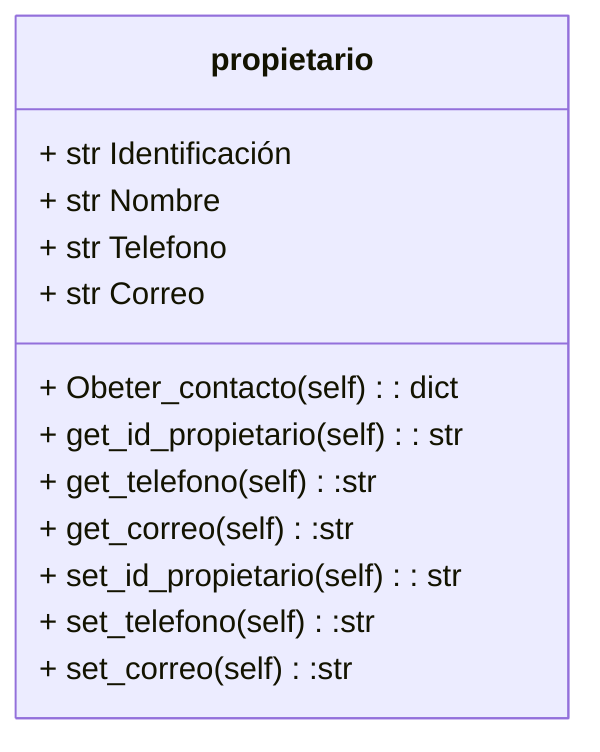
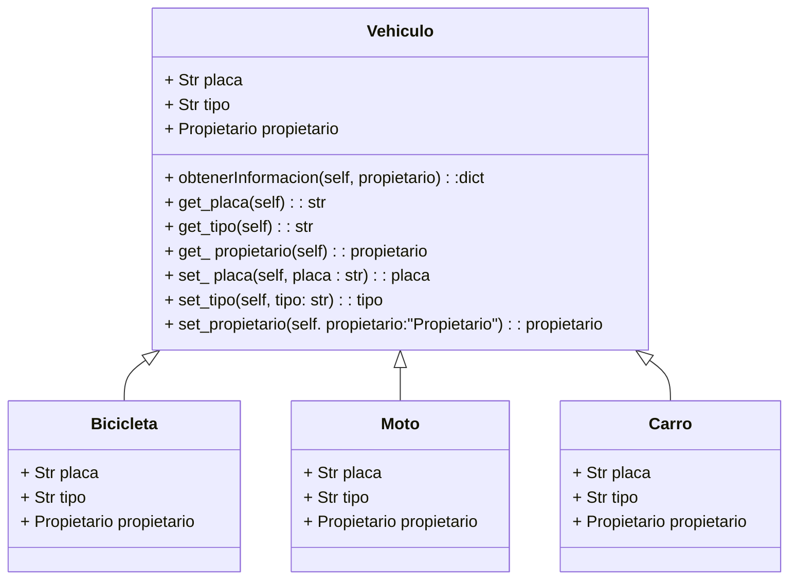
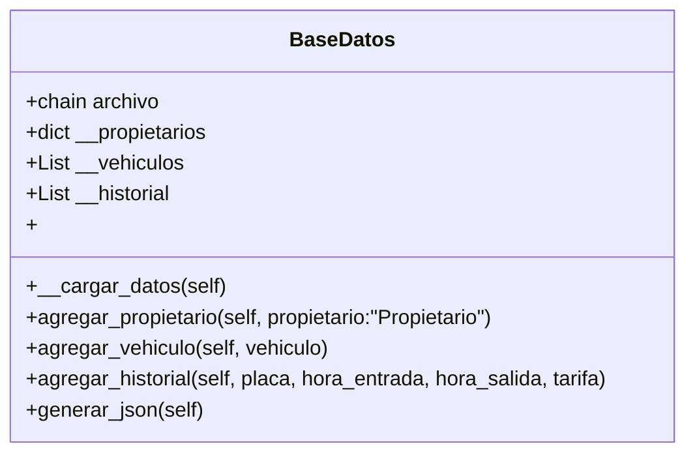
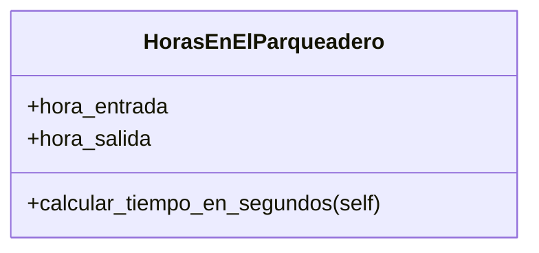
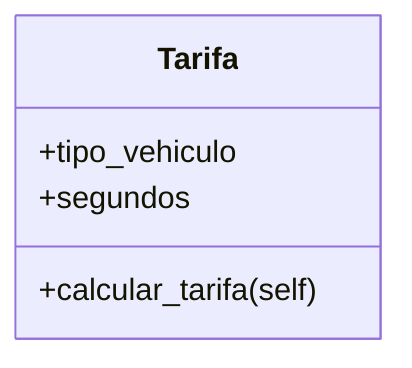
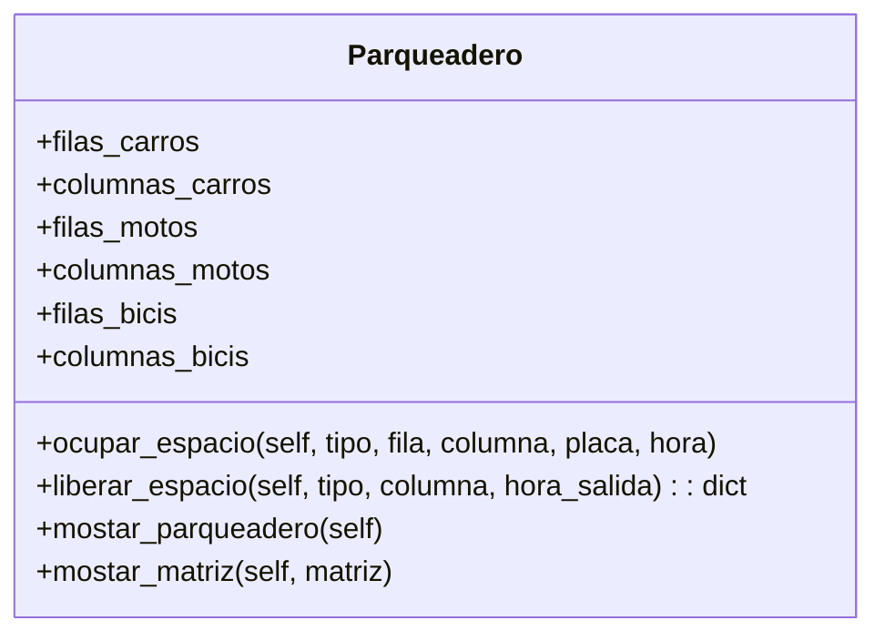
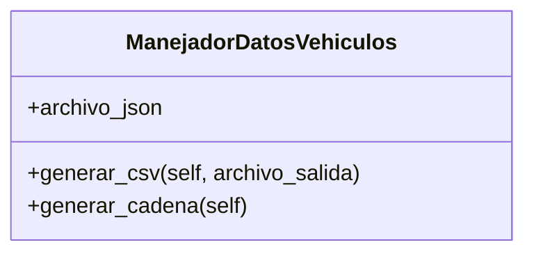

# Project POO

## Nombre del Grupo: ***Puppet Masters***

## Integrantes
- Juan Manuel Berdugo Torres
- Valentina Carreño Granados
- Fabian Camilo Arciniegas Morales

## Tabla de Contenido
- [Introducción](#introducción)
- [Problema](#problema)
- [Solución](#solución)
- [Diagramas de Clase](#diagramas-de-clase)
  - [Propietario](#propietario)
  - [Vehiculo](#vehiculo)
  - [BaseDeDatos](#basededatos)
  - [HorasEnElParqueadero](#horasenelparqueadero)
  - [Tarifa](#tarifa)
  - [Parqueadero](#parqueadero)
  - [ManejadorDatosVehiculo](#manejadordatosvehiculo)
- [Resultados Parciales](#resultados-parciales)
## Introducción
Usualmente cada vez que vamos a un centro comercial nos podemos encontrar con el mismo problema todos los dias, ya que encontrar un espacio de parqueo se puede convertir en una aventura, 
ya que las indicaciones que nos brindan los sistemas en estos centros comerciales pueden ser minimas o inexistentes, por eso mismo nuestro equipo ***Puppet Masters*** propone una solucion el cual es un codigo en pyhton el cual asignara un espacio en especifico al `vehiculo` en cuestion.

## Problema
El principal problema que buscamos resolver con este proyecto es facilitar la busqueda de un espacio de parqueo, ya que en centros comerciales o en grandes tiendas esta es una actividad que puede tardar varios minutos e incluso horas en horarios pico, esto afecta ya que es una perdida de tiempo, combustible y paciencia, lo que deja con una mala experiencia al cliente.

## Solución
...

## Diagramas de Clase

``` mermaid
classDiagram
    class ManejadorDatosVehiculos{
        +archivo_json
        +generar_csv(self, archivo_salida)
        +generar_cadena(self)
    }

    class propietario{
    + str Identificación
    + str Nombre 
    + str Telefono
    + str Correo
    + Obeter_contacto(self): dict 
    + get_id_propietario(self): str
    + get_telefono(self):str 
    + get_correo (self):str
    + set_id_propietario(self): str
    + set_telefono(self):str 
    + set_correo (self):str
    }

        class Vehiculo {
        + Str placa
        + Str tipo
        + Propietario propietario
        + obtenerInformacion(self, propietario):dict 
        + get_placa(self) : str
        + get_tipo(self) : str
        + get_ propietario (self): propietario
        + set_ placa (self, placa : str): placa 
        + set_tipo (self, tipo: str): tipo
        + set_propietario (self. propietario:"Propietario"): propietario
        
    }

    class Moto {
        +  Str placa
        + Str tipo
        + Propietario propietario

    }

    class Carro {
        + Str placa
        + Str tipo
        + Propietario propietario

    }
    class Bicicleta{
        +  Str placa
        + Str tipo
        + Propietario propietario
    }

    class BaseDatos{
        +
        +List __propietarios
        +List __vehiculos
        +List __historial
        +
        +__cargar_datos(self)
        +agregar_propietario(self, propietario:"Propietario")
        +agregar_vehiculo(self, vehiculo)
        +agregar_historial(self, placa, hora_entrada, hora_salida, tarifa)
        +generar_json(self)
}

    class HorasEnElParqueadero{
        +hora_entrada
        +hora_salida
        +calcular_tiempo_en_segundos(self)
    }

    class Tarifa{
        +tipo_vehiculo
        +segundos
        +calcular_tarifa(self)
    }

    class Parqueadero{
        +filas_carros
        +columnas_carros
        +filas_motos
        +columnas_motos
        +filas_bicis
        +columnas_bicis
        +ocupar_espacio(self, tipo, fila, columna, placa, hora)
        +liberar_espacio(self, tipo, columna, hora_salida): dict
        +mostar_parqueadero(self)
        +mostar_matriz(self, matriz)
    }

    class ManejadorDatosVehiculos{
        +archivo_json
        +generar_csv(self, archivo_salida)
        +generar_cadena(self)
    }

    Vehiculo  <|-- Bicicleta
    Vehiculo <|-- Moto
    Vehiculo <|-- Carro
```

### `Propietario`

### `Vehiculo`

### `BaseDeDatos`

### `HorasEnElParqueadero`

### `Tarifa`

### `Parqueadero`

### `ManejadorDatosVehiculo`

## Resultados Parciales
...
