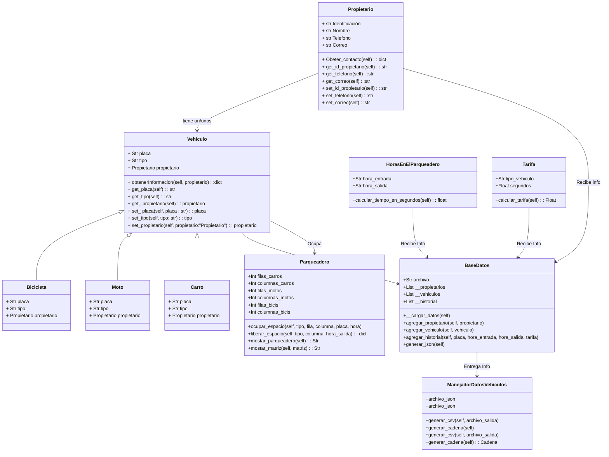
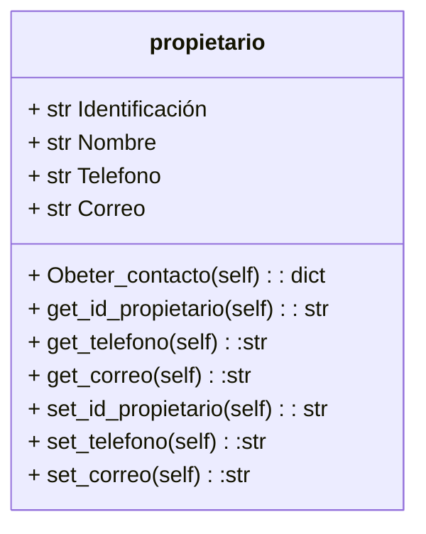
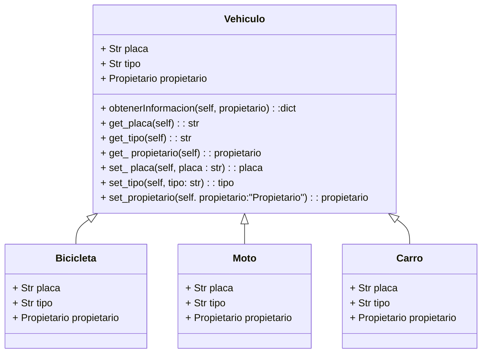
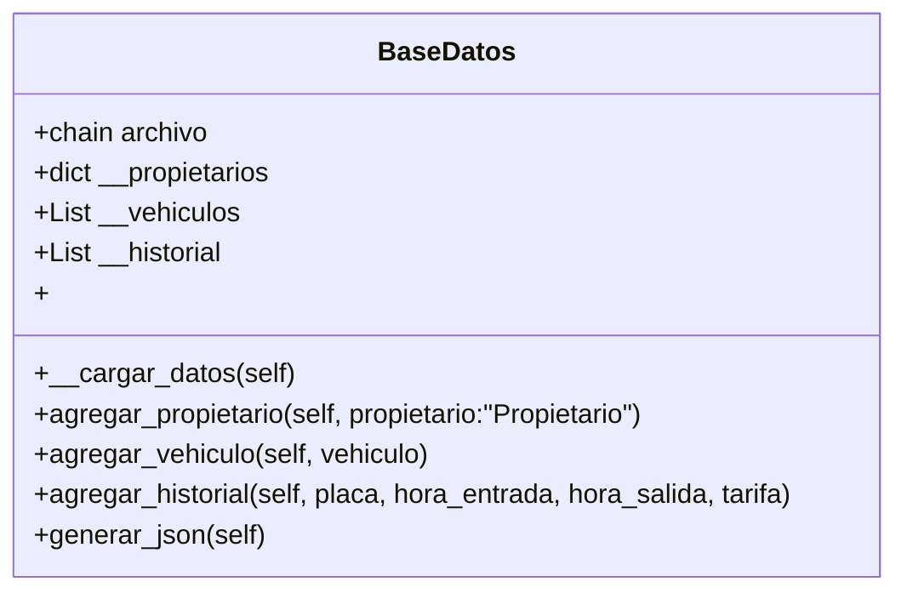
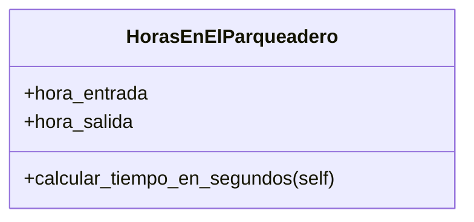
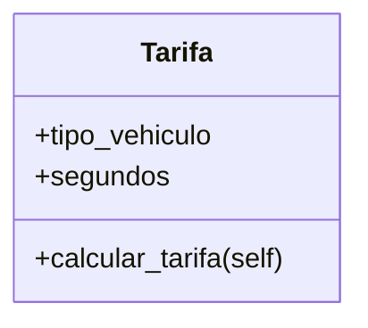
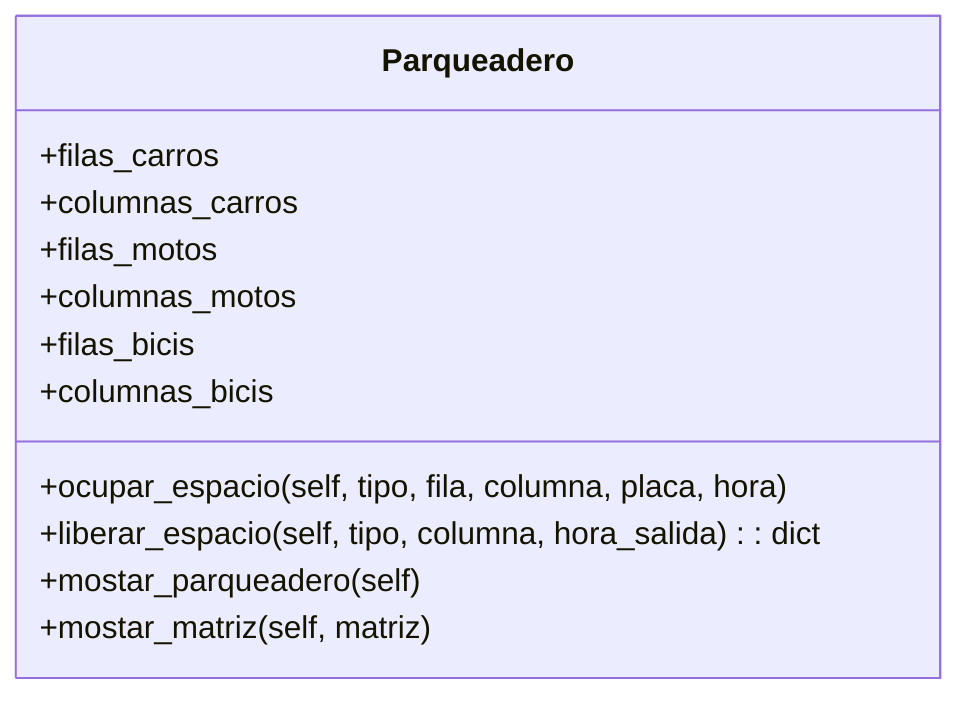
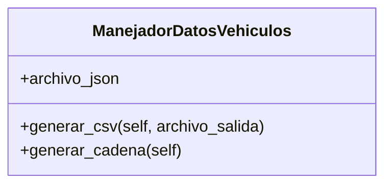

# Project POO

## Nombre del Grupo: ***Puppet Masters***

## Integrantes
- Juan Manuel Berdugo Torres
- Valentina Carreño Granados
- Fabian Camilo Arciniegas Morales

## Tabla de Contenido
- [Introducción](#introducción)
- [Problema](#problema)
- [Solución](#solución)
- [Diagramas de Clase](#diagramas-de-clase)
  - [Propietario](#propietario)
  - [Vehiculo](#vehiculo)
  - [BaseDeDatos](#basededatos)
  - [HorasEnElParqueadero](#horasenelparqueadero)
  - [Tarifa](#tarifa)
  - [Parqueadero](#parqueadero)
  - [ManejadorDatosVehiculo](#manejadordatosvehiculo)
- [Resultados Parciales](#resultados-parciales)
## Introducción
Usualmente cada vez que vamos a un centro comercial nos podemos encontrar con el mismo problema todos los dias, ya que encontrar un espacio de parqueo se puede convertir en una aventura, 
ya que las indicaciones que nos brindan los sistemas en estos centros comerciales pueden ser minimas o inexistentes, por eso mismo nuestro equipo ***Puppet Masters*** propone una solucion el cual es un codigo en pyhton el cual asignara un espacio en especifico al `vehiculo` en cuestion.

## Problema
El principal problema que buscamos resolver con este proyecto es facilitar la busqueda de un espacio de parqueo, ya que en centros comerciales o en grandes tiendas esta es una actividad que puede tardar varios minutos e incluso horas en horarios pico, esto afecta ya que es una perdida de tiempo, combustible y paciencia, lo que deja con una mala experiencia al cliente.

## Solución
Nuestra solución propuesta es la creación de un sistema que asigne espacios de estacionamiento específicos a los vehículos. Este sistema proporciona información sobre los espacios disponibles, reduciendo significativamente el tiempo empleado en buscar un lugar. Al implementar esta tecnología, buscamos mejorar la experiencia general de estacionamiento para los compradores y fomentar el uso eficiente de los recursos.

## Diagramas de Clase

### `Propietario`
Esta clase se usa para instanciar diferentes datos del propietario, ademas de contar con sus diferentes setters and getters, ademas de una funcion que nos devuelve todos estos datos recopilados en un diccionario

### `Vehiculo`
Esta clase se utiliza para crear diferentes vehículos, aprovechando las características que los diferencian, como su placa o su propietario. Además, incluye métodos para acceder a información privada, como los datos del usuario

### `BaseDeDatos`
La clase `BaseDeDatos` genera un archivo json donde se guardan la informacion de los propietarios, vehiculos y uso del parqueadero.

### `HorasEnElParqueadero`
Esta clase calcula el tiempo que estuvo el vehiculo en el parqueadero.

### `Tarifa`
Esta clase utiliza datetime para calcular el tiempo que un vehículo permanece en el parqueadero. Posteriormente, multiplica el tiempo, dado en segundos, por la tarifa correspondiente a cada clase de vehículo.

### `Parqueadero`
Esta clase genera una matriz que contiene información sobre el estado de cada espacio.

### `ManejadorDatosVehiculo`
Genera un csv con el reporte de todos ls movimientos que se han realizado en el parqueadero.

## Resultados Parciales
El código es capaz de generar una matriz que simula un parqueadero, consultar el estado de cada celda y, con base en la ocupación, asignar un espacio a cada usuario. Además, calcula la tarifa de cada usuario en función del tiempo que estuvo en el parqueadero y el tipo de vehículo que utiliza.
