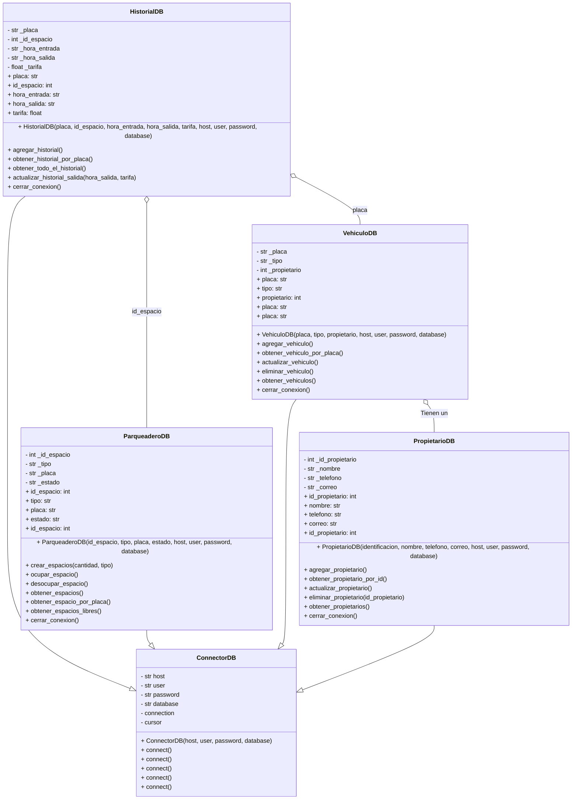
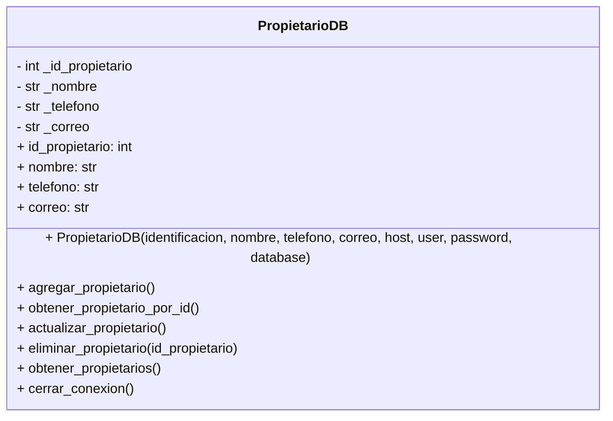
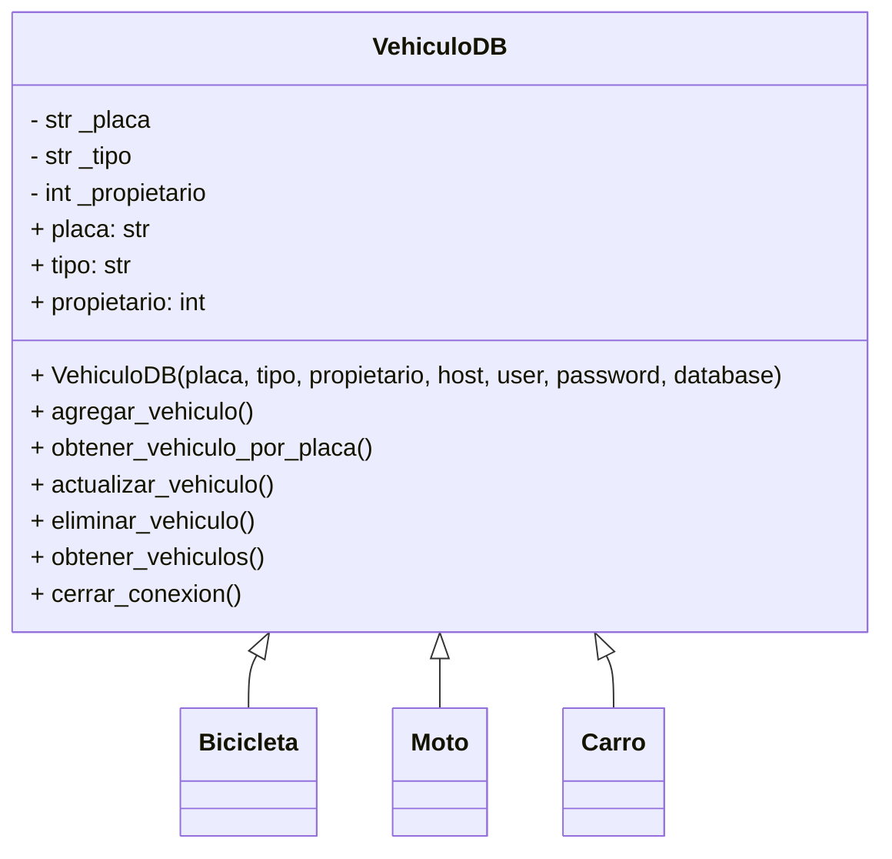
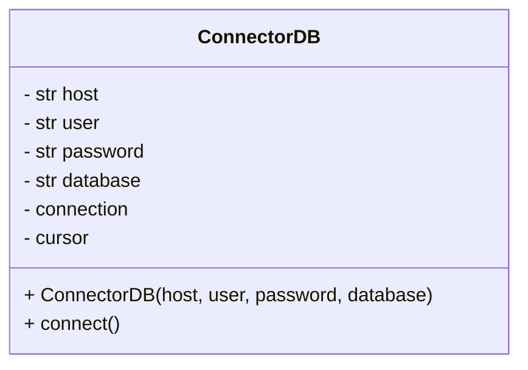
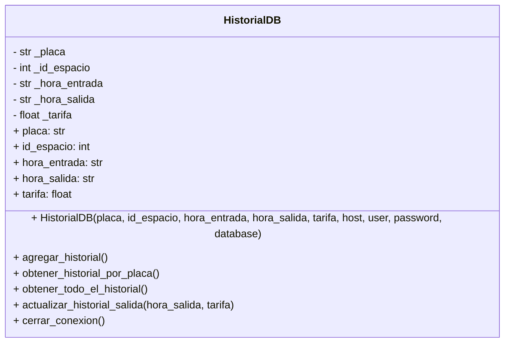
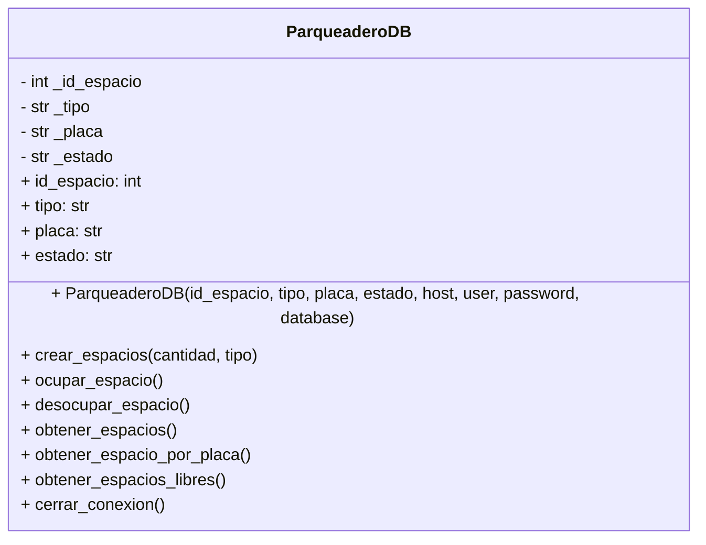
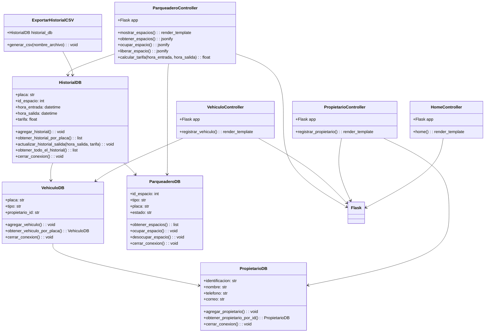

# Project POO

## Nombre del Grupo: ***Puppet Masters***

## Integrantes
- Juan Manuel Berdugo Torres
- Valentina Carreño Granados
- Fabian Camilo Arciniegas Morales

## Tabla de Contenido
- [Introducción](#introducción)
- [Problema](#problema)
- [Solución](#solución)
- [Diagramas de Clase](#diagramas-de-clase)
  - [PropietarioDB](#propietarioDB)
  - [VehiculoDB](#vehiculoDB)
  - [ParqueaderoDB](#parqueaderoDB)
- [Resultados Parciales](#resultados-parciales)
- 
## Introducción
El tráfico en las grandes ciudades es un problema creciente que afecta la movilidad y calidad de vida de millones de personas. La saturación vehicular no solo genera largas demoras, sino que también incrementa la contaminación ambiental y el estrés en los conductores. Un factor clave que contribuye a este problema es la dificultad para encontrar estacionamiento, lo que provoca que muchos conductores den vueltas innecesarias dentro de los parqueaderos o incluso en las calles, aumentando el tráfico y el consumo de combustible. Estudios han demostrado que la exposición prolongada a situaciones de congestión vehicular eleva los niveles de cortisol, la hormona del estrés, lo que puede derivar en problemas de salud como hipertensión y fatiga crónica. Para mitigar estos efectos, es esencial contar con soluciones que optimicen la búsqueda de estacionamiento y reduzcan el tiempo que los conductores permanecen innecesariamente en circulación.

## Problema
Uno de los mayores problemas en los parqueaderos es la falta de información en tiempo real sobre la disponibilidad de espacios, lo que obliga a los conductores a recorrer el estacionamiento sin una guía clara. En promedio, una persona puede tardar hasta 8 minutos buscando un lugar para estacionar, lo que no solo genera frustración y estrés, sino que también contribuye al tráfico dentro del parqueadero y al desperdicio de tiempo y combustible. Esta situación impacta negativamente la experiencia del usuario, especialmente en lugares concurridos como centros comerciales, donde el flujo constante de vehículos dificulta aún más el proceso. Para abordar este problema, es fundamental contar con un sistema eficiente que optimice la asignación de espacios y brinde información actualizada a los conductores.

## Solución
Desarrollar un sistema inteligente de gestión de parqueaderos que permita monitorear en tiempo real la disponibilidad de espacios, informando a los usuarios sobre los lugares libres y registrando automáticamente la entrada y salida de los vehículos. La información será procesada y mostrada en una interfaz accesible para los usuarios, facilitando la búsqueda de estacionamiento. Además, el sistema llevará un registro detallado de los vehículos que ingresan y salen, optimizando la administración del parqueadero.

## Diagramas de Clase

### `PropietarioDB`
Esta clase se usa para instanciar diferentes datos del propietario, ademas de contar con sus diferentes setters and getters, ademas de una funcion que nos devuelve todos estos datos recopilados en un diccionario

### `VehiculoDB`
Esta clase se utiliza para crear diferentes vehículos, aprovechando las características que los diferencian, como su placa o su propietario. Además, incluye métodos para acceder a información privada, como los datos del usuario.

### `ConectorDB`
Esta clase calcula el tiempo que estuvo el vehiculo en el parqueadero.

### `HistorialDB`
Esta clase utiliza datetime para calcular el tiempo que un vehículo permanece en el parqueadero. Posteriormente, multiplica el tiempo, dado en segundos, por la tarifa correspondiente a cada clase de vehículo.

### `ParqueaderoDB`
Esta clase genera atributos que contiene información sobre el estado de cada espacio.

# CONTROLLER

## Resultado

El desarrollo del sistema de gestión de parqueaderos dio como resultado una aplicación web funcional que permite la administración eficiente de los espacios de estacionamiento. Se implementaron diversas interfaces que facilitan la interacción del usuario, incluyendo pantallas para el registro de propietarios y vehículos, la visualización de espacios disponibles y el control del historial de uso del parqueadero.

En cuanto al almacenamiento de datos, se lograron registrar propietarios con información detallada (nombre, identificación, contacto), así como vehículos asociados a cada usuario. Además, el sistema almacena el historial de entradas y salidas de los vehículos, calculando automáticamente la tarifa correspondiente en función del tiempo de uso.

Para la gestión del parqueadero, se desarrollaron funcionalidades clave, como la ocupación y liberación de espacios en tiempo real, con respuestas inmediatas a través de la API. Asimismo, se implementó la opción de exportar el historial en formato CSV, facilitando la consulta y análisis de datos.

Finalmente, el modelo relacional y el diagrama de clases reflejan la estructura del sistema, evidenciando la correcta integración entre los distintos módulos y garantizando su escalabilidad y mantenimiento a futuro.

# View

# RECURSOS USADOS

### Flask
Es un framework web en Python que usamos para desarrollar la API del sistema de gestión de parqueaderos. Nos permitió manejar solicitudes HTTP, conectar la base de datos y facilitar la comunicación entre la interfaz y la lógica del sistema.
### MySQL 
Fue utilizado como el sistema de gestión de bases de datos para almacenar y administrar la información del parqueadero. Su uso permitió manejar grandes volúmenes de datos de manera estructurada y eficiente.
### CVS
El formato CSV se utilizó para exportar y almacenar registros históricos de manera simple y accesible.
Funciones clave:
Generación de reportes: Permitió exportar el historial de parqueo en un formato compatible con herramientas externas como Excel.

